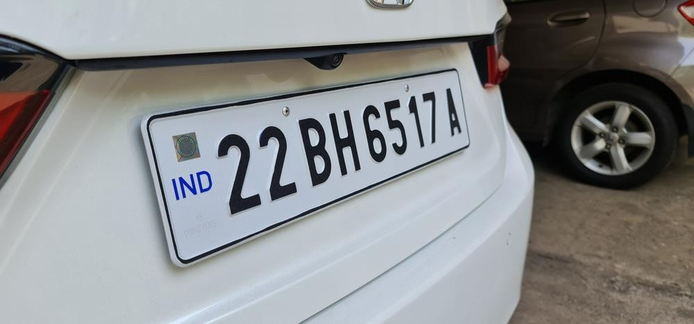
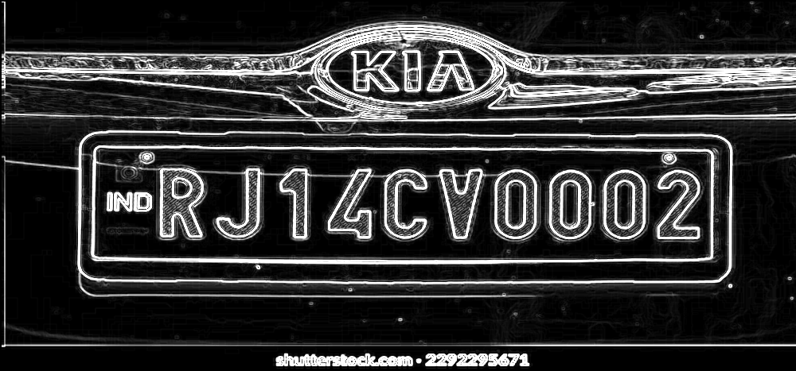

# FPGA-Accelerated Sobel Edge Detector for Number-Plate Detection

[](sobel_accel.v)
[](https://www.python.org/)
[](https://opencv.org/)
[](https://steveicarus.github.io/iverilog/)
[](sobel_accel.v)

This project explores a hardware/software pipeline for detecting vehicle number plates. The pixel-wise Sobel edge operator is implemented as a streaming Verilog accelerator, while Python utilities prepare image data, reconstruct the simulated output, locate a plate-like contour, and optionally run OCR.

> **Current scope:** the repository contains synthesizable-style RTL and an offline Icarus Verilog simulation testbench. It does not yet contain FPGA-vendor project files, pin constraints, timing reports, or a live camera/display interface.

## Pipeline

```text
RGB image
    │
    ├─ main2.py ──► image.hex (row-major 24-bit RGB pixels)
    │
    ├─ tb_sobel_accel.v + sobel_accel.v ──► output.hex
    │                                          (valid Sobel magnitudes)
    │
    ├─ main3.py ──► output.png (reconstructed 8-bit edge map)
    │
    └─ finalmai.py / final copy.py ──► thresholding, contours, crop, OCR
```

The checked-in example images illustrate the intended result:

| Input | Reconstructed Sobel output |
| --- | --- |
|  |  |

## How the accelerator works

`sobel_accel.v` accepts one 24-bit RGB pixel when `in_valid` is asserted and produces a 24-bit grayscale edge value on `out_pixel` with `out_valid` indicating a usable result.

Key implementation details:

- Default frame size: `IMG_WIDTH = 1000`, `IMG_HEIGHT = 467`.
- RGB-to-grayscale conversion uses the integer approximation `(30R + 59G + 11B) / 100`.
- Two line buffers retain the previous two rows.
- Shift registers form a 3×3 neighborhood.
- Sobel gradients are calculated with the standard horizontal and vertical kernels.
- Edge strength uses the L1 magnitude `|Gx| + |Gy|`, clamped to 255.
- The magnitude is replicated into R, G, and B, so the output is visually grayscale.
- `out_valid` becomes high once the stream has reached at least row 2 and column 2. The first two rows and columns are therefore absent from the simulation output.

For the default frame size, the testbench writes `998 × 465 = 464,070` valid output samples.

## Repository layout

| File | Purpose |
| --- | --- |
| [`sobel_accel.v`](sobel_accel.v) | Parameterized Sobel streaming accelerator RTL. |
| [`tb_sobel_accel.v`](tb_sobel_accel.v) | Verilog testbench; loads `image.hex`, clocks the DUT, and writes `output.hex`. |
| [`main2.py`](main2.py) | Resizes an input image to 1000×467 and creates row-major RGB `image.hex`. |
| [`main3.py`](main3.py) | Converts valid samples in `output.hex` into an 8-bit `output.png`. |
| [`main.py`](main.py) | CPU-only OpenCV baseline using Canny edge detection and OCR. |
| [`final.py`](final.py) | Earlier hardware-output plate-detection experiment. |
| [`final copy.py`](final%20copy.py) | More verbose contour filtering and OCR experiment. |
| [`finalmai.py`](finalmai.py) | Hardware-edge thresholding, contour search, crop, and OCR experiment. |
| `car.png`, `car2.png`, `car3.png` | Example vehicle images. |
| `image.hex`, `image3.hex` | Sample hexadecimal pixel streams. |
| `output.hex`, `output3.png`, `output.png` | Sample simulation/reconstruction artifacts. |
| `image_data.txt` | Small auxiliary data file. |

## Requirements

### RTL simulation

The project simulation flow uses Icarus Verilog:

- [Icarus Verilog](https://steveicarus.github.io/iverilog/) (the commands below use `iverilog` and `vvp`). Other Verilog simulators may also work with equivalent commands.

### Python image pipeline

Python 3 and the following packages are used by the scripts:

```text
Pillow
opencv-python
numpy
matplotlib
pytesseract
```

`pytesseract` is only needed for the OCR scripts. It is a Python wrapper, so the [Tesseract OCR engine](https://github.com/tesseract-ocr/tesseract) must also be installed and available on `PATH` for OCR to work.

Example setup:

```bash
python -m venv .venv
# Windows: .venv\\Scripts\\activate
# Linux/macOS: source .venv/bin/activate
python -m pip install Pillow opencv-python numpy matplotlib pytesseract
```

## Reproduce the simulation

Run these commands from the repository root.

1. Generate the simulator input stream. `main2.py` currently uses `car.png` by default; edit `INPUT_IMAGE_FILE` if another source image is desired.

   ```bash
   python main2.py
   ```

2. Compile the RTL and testbench with Icarus Verilog:

   ```bash
   iverilog -g2012 -o sobel_sim sobel_accel.v tb_sobel_accel.v
   ```

3. Run the testbench. It reads `image.hex` and overwrites `output.hex`.

   ```bash
   vvp sobel_sim
   ```

4. Reconstruct a viewable edge image:

   ```bash
   python main3.py
   ```

The testbench also produces `waveform.vcd` for waveform inspection in a VCD viewer such as GTKWave. These generated files are not part of the source design and can be removed after inspection.

## Plate detection and OCR

After generating `output.png`, the experimental post-processing scripts can be run with:

```bash
python finalmai.py
```

The post-processing stage thresholds the Sobel magnitude map, finds contours, selects a quadrilateral or plate-like region, crops the corresponding area from the resized source image, and passes it to Tesseract. Thresholds, contour limits, aspect-ratio filters, and OCR configuration are currently hard-coded in the scripts and may need tuning for different images.

`main.py` provides a CPU baseline using bilateral filtering and OpenCV Canny edges rather than the Verilog output.

## Parameters and interface

The top-level module is parameterized so the frame dimensions can be changed at elaboration time:

```verilog
sobel_accel #(
    .IMG_WIDTH(1000),
    .IMG_HEIGHT(467)
) DUT (...);
```

| Signal | Direction | Width | Description |
| --- | --- | ---: | --- |
| `clk` | input | 1 | Active clock; the testbench uses a 10 ns period. |
| `rst_n` | input | 1 | Active-low asynchronous reset. |
| `in_pixel` | input | 24 | RGB pixel in `RRGGBB` order. |
| `in_valid` | input | 1 | Indicates that `in_pixel` is valid for the current cycle. |
| `out_pixel` | output | 24 | Grayscale Sobel magnitude replicated across RGB channels. |
| `out_valid` | output | 1 | Indicates that `out_pixel` corresponds to a valid interior-window result. |

Pixels must be supplied in row-major order, from `(x=0, y=0)` to `(x=IMG_WIDTH-1, y=IMG_HEIGHT-1)`, with no separate line or frame handshake in the current interface.

## Acknowledgements

This project demonstrates the integration of FPGA-based image processing with Python-based number-plate detection and OCR. It was developed as an experimental platform for exploring hardware acceleration of computer-vision workloads.
